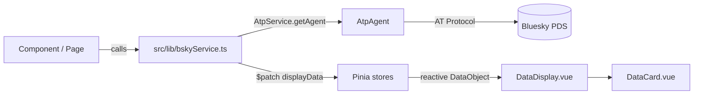
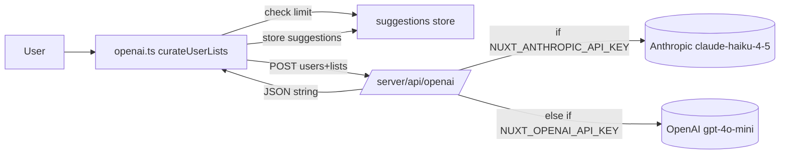

# Bluelist Architecture

Bluelist is a [Nuxt 4](https://nuxt.com) single-page application that helps Bluesky
users organize the accounts they follow into [AT Protocol](https://atproto.com)
lists, with optional AI-assisted suggestions. This document describes how the app
is structured so that both humans and AI assistants can navigate and extend it
confidently.

## Tech Stack

| Concern         | Choice                                                              |
| --------------- | ------------------------------------------------------------------- |
| Framework       | Nuxt 4 (Vue 3, `<script setup>`)                                    |
| State           | Pinia (options-store style)                                         |
| Bluesky API     | `@atproto/api` (`AtpAgent`)                                         |
| AI              | Anthropic `claude-haiku-4-5` or OpenAI `gpt-4o-mini` (server route) |
| Language        | TypeScript (strict, `typeCheck: true`)                              |
| Package manager | Yarn 1.x                                                            |
| Tooling         | ESLint (`@nuxt/eslint`), Prettier, Husky, lint-staged, commitlint   |

## Directory Map

```text
app.vue, error.vue          # Root app + error boundary
middleware/router.ts        # Global auth route guard
scripts/run.mjs             # Cross-platform Nuxt launcher (injects NODE_EXTRA_CA_CERTS early)
pages/                      # File-based routes (index, feed, follows, lists, list/[slug]/*)
server/api/                 # Nitro endpoints (openai, exemptUsers)
public/                     # Static assets (client-metadata.json, robots.txt)
src/
  components/               # Vue components (PascalCase)
  lib/                      # Framework-agnostic services
    AtpService.ts           #   Singleton AtpAgent manager
    bskyService.ts          #   All Bluesky read/write operations
    openai.ts               #   AI suggestion orchestration (client side)
  stores/                   # Pinia stores (auth, follows, lists, suggestions, ui)
  types/                    # Domain-split TypeScript types
  utils/slug-utils.ts       # List name <-> URL slug mapping
  assets/styles/            # Per-component CSS + shared _variables.css
```

## Core Data Flow

The central pattern: **components call service functions, services fetch from
Bluesky/OpenAI and write results into Pinia stores, and components render the
store-backed `DataObject`.**



### The `DataObject` contract

Almost every view renders a single discriminated union defined in
[src/types/misc-types.ts](../src/types/misc-types.ts):

```ts
interface DataObject {
  type:
    | 'timeline'
    | 'lists'
    | 'follows'
    | 'list-posts'
    | 'list-members'
    | 'error'
    | 'loading';
  data:
    | TimelineItem[]
    | ListItem[]
    | FollowItem[]
    | SuggestionItem[]
    | { message: string }[];
  pagination?: { currentPage?; totalPages?; totalPrefetched?; hasMorePages? };
  listInfo?: { name: string; description?: string; uri: string };
}
```

`DataCard.vue` switches on `item.type` to decide how to render each row. When you
add a new view type, extend the union **and** add a matching branch in the card.

### Service return convention

Read functions in [src/lib/bskyService.ts](../src/lib/bskyService.ts) return a
`{ displayData: DataObject, usersJSON | timelineJSON | ... }` object **and** write
the same data into the relevant store via `store.$patch(...)`. Callers can either
use the return value directly or rely on store reactivity. Keep both in sync when
adding functions.

## Services (`src/lib/`)

### `AtpService`

A singleton wrapper around a single `AtpAgent` instance:

- `getAgent()` / `getBskyAgent()` — lazily creates the agent using
  `runtimeConfig.public.atpService`.
- `setAuthToken(jwt)` — sets the `Authorization: Bearer` header.
- `resetAgent()` — clears the instance on logout.

Always obtain the agent through `AtpService`; never instantiate `AtpAgent`
directly elsewhere.

### `bskyService`

All Bluesky operations live here (reads: timeline, follows, lists, list members,
list posts; writes: add/remove users, create/update/delete lists). Every function:

1. Guards with `if (!authStore.isLoggedIn) throw new Error('Please login first')`.
2. Gets the agent via `AtpService`.
3. On error, checks `if ((error as Error).message === 'Token has expired')` and
   calls `authStore.handleSessionExpired()` before rethrowing.

### `openai.ts` (client)

`curateUserLists()` orchestrates AI suggestions: it enforces the daily limit via
`suggestionsStore.hasReachedLimit()`, gathers the current-page follows and all
lists, POSTs them to `/api/openai`, and stores the parsed suggestions.

## State Management (`src/stores/`)

| Store         | Responsibility       | Notable state                                                              |
| ------------- | -------------------- | -------------------------------------------------------------------------- |
| `auth`        | Login/session/DID    | `isLoggedIn`, `did`, `initialized`, `handleSessionExpired()`               |
| `follows`     | Paginated follows    | `follows.allFollows`, `cursor`, `itemsPerPage: 20`                         |
| `lists`       | Lists + list members | separate `lists` (10/pg) and `members` (10/pg) slices, `memberCountsCache` |
| `suggestions` | AI request tracking  | `requestCounts` (localStorage, per-DID daily), `isProcessingSuggestions`   |
| `ui`          | Current view data    | `displayData` (`DataObject`), `timelineJSON`                               |

Stores use Pinia's **options API** (`state`, `getters`, `actions`). Cross-store
access is done by calling the other store's composable inside an action
(e.g. `useSuggestionsStore()` inside `auth.login()`).

### Pagination + prefetch

Follows/lists/members use cursor-based pagination with a prefetch strategy: when a
requested page exceeds what is cached and a `cursor` exists, the service fetches
the next batch, appends it to `all*` arrays, and advances `prefetchedPages`. The
`isFetching` flag prevents concurrent fetches for the same slice.

## Authentication

Current auth is **credential-based** (`agent.login({ identifier, password })`):

- Login requires an **email** identifier (handles are rejected to avoid rate
  limits). The returned `accessJwt` is set on the agent and `loginData` is
  persisted to `localStorage`.
- [middleware/router.ts](../middleware/router.ts) restores the session once
  (`checkLoginSession`), redirects unauthenticated users to `/`, and redirects
  authenticated users away from `/` to `/lists`.
- On token expiry, `authStore.handleSessionExpired()` clears storage and reloads.

> An OAuth login flow is in progress (see `pages/oauth-callback.vue` and
> `public/client-metadata.json`); it is not yet wired into the services above.

## AI Suggestions Pipeline



- **Multi-LLM:** the server route prefers Anthropic (`claude-haiku-4-5-20251001`)
  when `NUXT_ANTHROPIC_API_KEY` is set; falls back to OpenAI `gpt-4o-mini` when
  only `NUXT_OPENAI_API_KEY` is set. At least one key is required.
- **Daily limit:** 5 requests/user/day, tracked per-DID in `localStorage`.
- **Exemption:** `POST /api/exemptUsers` checks `NUXT_EXEMPT_DIDS` and can bypass
  the limit.
- **Prompt:** the curator system prompt is defined inline in
  [server/api/openai.ts](../server/api/openai.ts) and constrains the model to
  existing lists only, returning a strict JSON shape.

## Server API (`server/api/`)

| Route              | Method | Body                             | Returns                                                    |
| ------------------ | ------ | -------------------------------- | ---------------------------------------------------------- |
| `/api/openai`      | POST   | `{ users, lists }` (stringified) | JSON string `{ data: [{ name, did, lists: [{ name }] }] }` |
| `/api/exemptUsers` | POST   | `{ did }`                        | `{ isExempt: boolean }`                                    |

Secrets (`anthropicApiKey`, `openaiApiKey`, `exemptDids`) are read from
`runtimeConfig` server-side only; never expose them to the client.

## Slug System

[src/utils/slug-utils.ts](../src/utils/slug-utils.ts) maps human-readable list
names to URL slugs and back, so routes like `/list/my-cool-list/posts` resolve to
an AT-URI. Mappings live in a bidirectional `Map` and are persisted to
`localStorage` (`bluelist_slug_mappings`). Call `addMapping(uri, name)` whenever
lists are fetched so the slug is available for navigation.

## Conventions At A Glance

- **Components:** PascalCase filenames, `<script setup>` + typed props, BEM CSS
  class names, and a per-component CSS file imported from
  `src/assets/styles/` inside `<script setup>`
  (e.g. `import '~/src/assets/styles/data-card.css';`).
- **Utilities/services:** kebab-case filenames for utils; import via the `~` alias
  (`~/src/...`) or Nuxt aliases (`#imports`, `#app`).
- **Types:** split by domain under `src/types/` and re-exported from
  `src/types/index.ts`.
- **Commits:** Conventional Commits, enforced by commitlint.

See [CONTRIBUTING.md](../CONTRIBUTING.md) for setup and workflow details.
