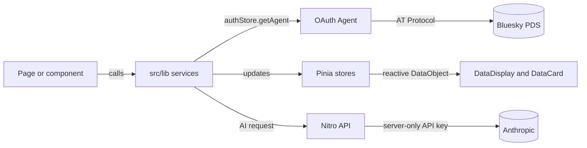
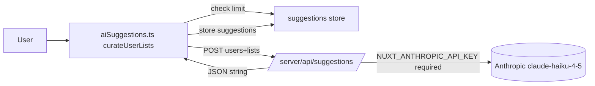

# Bluelist Architecture

Bluelist is a [Nuxt 4](https://nuxt.com) single-page application that helps
Bluesky users organize the accounts they follow into
[AT Protocol](https://atproto.com) lists. It uses Vue 3, Pinia, strict
TypeScript, and Yarn 1; optional Anthropic-powered list suggestions execute only
on the Nitro server. This document is the primary architecture guide for human
contributors and AI assistants.

## Tech Stack

| Concern         | Choice                                                            |
| --------------- | ----------------------------------------------------------------- |
| Framework       | Nuxt 4 (Vue 3, `<script setup>`)                                  |
| State           | Pinia (options-store style)                                       |
| Bluesky API     | `@atproto/api` OAuth-authenticated `Agent`                        |
| AI              | Anthropic `claude-haiku-4-5` (server route)                       |
| Language        | TypeScript (strict, `typeCheck: true`)                            |
| Package manager | Yarn 1.x                                                          |
| Tooling         | ESLint (`@nuxt/eslint`), Prettier, Husky, lint-staged, commitlint |

## Runtime And Startup

- `package.json` defines the Yarn commands: `dev`, `build`, `preview`, and
  `generate` delegate to `scripts/run.mjs`; `lint` runs ESLint and `format`
  runs Prettier.
- `scripts/run.mjs` launches the local Nuxt binary, loads `.env.local`, and
  applies a valid `NODE_EXTRA_CA_CERTS` before Node initializes TLS.
- `nuxt.config.ts` enables Pinia, ESLint, scripts, test utilities, TypeScript
  checking, Nitro, runtime configuration, and the development server. HTTP
  defaults to `127.0.0.1:3000`; optional local HTTPS can use machine-local
  certificates configured through `.env.local`.
- `app.vue` renders the application shell, header, and current Nuxt page.
  `error.vue` supplies the application error page.
- `tsconfig.json` extends Nuxt's generated configuration, `eslint.config.mjs`
  imports Nuxt's ESLint configuration, and `commitlint.config.js` enables
  Conventional Commits. Husky runs lint-staged before commits and validates
  commit messages; see [.husky/README.md](.husky/README.md).

## Project Map

- [pages/](pages/README.md): file-based routes for sign-in, dashboard views,
  the OAuth callback, and list-detail views.
- [middleware/](middleware/README.md): browser route middleware that restores
  auth and enforces redirects.
- [src/](src/README.md): browser components, Bluesky services, Pinia stores,
  types, utilities, and visual assets.
- [server/](server/README.md): Nitro API endpoints and public OAuth metadata.
- [public/](public/README.md): directly served static assets.
- [scripts/](scripts/README.md): local Nuxt launcher and environment/TLS setup.
- [Agent tooling](agent-tooling.md): canonical agent rules, path-scoped
  instructions, reusable workflows, and tool configuration.

## Core Data Flow

The central pattern is: **components call services, services obtain the
OAuth-authenticated agent, fetch from Bluesky or Nitro, update Pinia stores, and
components render the store-backed `DataObject`.**


```mermaid
flowchart LR
  C[Page or component] -->|calls| S[src/lib services]
  S -->|authStore.getAgent| A[OAuth Agent]
  A -->|AT Protocol| BSKY[(Bluesky PDS)]
  S -->|updates| ST[Pinia stores]
  ST -->|reactive DataObject| DD[DataDisplay and DataCard]
  S -->|AI request| N[Nitro API]
  N -->|server-only API key| ANT[(Anthropic)]
```

### The `DataObject` contract

Almost every view renders a single discriminated union defined in
[src/types/misc-types.ts](../src/types/misc-types.ts):

```ts
interface DataObject {
  type:
    | 'timeline'
    | 'lists'
    | 'follows'
    | 'list-posts'
    | 'list-members'
    | 'error'
    | 'loading';
  data:
    | TimelineItem[]
    | ListItem[]
    | FollowItem[]
    | SuggestionItem[]
    | { message: string }[];
  pagination?: { currentPage?; totalPages?; totalPrefetched?; hasMorePages? };
  listInfo?: { name: string; description?: string; uri: string };
}
```

`DataCard.vue` switches on `item.type` to decide how to render each row. When you
add a new view type, extend the union **and** add a matching branch in the card.

### Service return convention

Read functions in [src/lib/bskyService.ts](../src/lib/bskyService.ts) return a
`{ displayData: DataObject, usersJSON | timelineJSON | ... }` object **and** write
the same data into the relevant store via `store.$patch(...)`. Callers can either
use the return value directly or rely on store reactivity. Keep both in sync when
adding functions.

## Services (`src/lib/`)

### `bskyService`

All Bluesky operations live here (reads: timeline, follows, lists, list members,
list posts; writes: add/remove users, create/update/delete lists). Every function:

1. Guards with `if (!authStore.isLoggedIn) throw new Error('Please login first')`.
2. Gets the agent via `authStore.getAgent()` — the OAuth-authenticated `Agent`.
   Never instantiate `AtpAgent`/`Agent` directly elsewhere; it would have no
   session and every call would 401.
3. On error, logs and rethrows a user-facing error. Unrecoverable session
   invalidation is handled centrally via the OAuth client's `'deleted'` event
   (see `OAuthService.onSessionDeleted` → `authStore.handleSessionExpired()`),
   not per call site.

### `aiSuggestions.ts` (client)

`curateUserLists()` orchestrates AI suggestions: it enforces the daily limit via
`suggestionsStore.hasReachedLimit()`, gathers the current-page follows and all
lists, POSTs them to `/api/suggestions`, and stores the parsed suggestions.

## State Management (`src/stores/`)

| Store         | Responsibility       | Notable state                                                              |
| ------------- | -------------------- | -------------------------------------------------------------------------- |
| `auth`        | Login/session/DID    | `isLoggedIn`, `did`, `initialized`, `handleSessionExpired()`               |
| `follows`     | Paginated follows    | `follows.allFollows`, `cursor`, `itemsPerPage: 20`                         |
| `lists`       | Lists + list members | separate `lists` (10/pg) and `members` (10/pg) slices, `memberCountsCache` |
| `suggestions` | AI request tracking  | `requestCounts` (localStorage, per-DID daily), `isProcessingSuggestions`   |
| `ui`          | Current view data    | `displayData` (`DataObject`), `timelineJSON`                               |

Stores use Pinia's **options API** (`state`, `getters`, `actions`). Cross-store
access is done by calling the other store's composable inside an action
(e.g. `useSuggestionsStore()` inside `auth.login()`).

### Pagination + prefetch

Follows/lists/members use cursor-based pagination with a prefetch strategy: when a
requested page exceeds what is cached and a `cursor` exists, the service fetches
the next batch, appends it to `all*` arrays, and advances `prefetchedPages`. The
`isFetching` flag prevents concurrent fetches for the same slice.

## Client And Server Boundaries

The browser bundle contains pages, components, Pinia state, browser OAuth,
Bluesky orchestration, types, utilities, and visual assets under `src/`.
`public/` contains directly served static files. Browser code can call the Nitro
handlers under `server/`, but it cannot access their private runtime
configuration.

`nuxt.config.ts` maps `NUXT_ANTHROPIC_API_KEY` and `NUXT_EXEMPT_DIDS` to
server-only runtime configuration. Only `NUXT_ATP_SERVICE` is configured under
the public runtime configuration namespace. The Anthropic key and exemption
list must remain outside client code.

## Authentication

Auth is **OAuth-based** (AT Proto OAuth, via `@atproto/oauth-client-browser`),
the sole login path — password/`createSession` login has been removed:

- The user enters a Bluesky handle; [`OAuthService`](../src/lib/OAuthService.ts)
  builds a loopback client (localhost) or a discoverable client (deployed,
  metadata served dynamically at [`/client-metadata.json`](../server/routes/client-metadata.json.ts))
  and redirects to the provider for consent.
- [`pages/oauth-callback.vue`](../pages/oauth-callback.vue) completes the
  callback and checks `authStore.isLoggedIn` before routing to `/lists` or back
  to `/` with an error.
- [middleware/router.ts](../middleware/router.ts) restores the session once per
  app load (`checkLoginSession`), redirects unauthenticated users to `/`, and
  redirects authenticated users away from `/` to `/lists`.
- Unrecoverable session invalidation (refresh failure) fires the OAuth client's
  `'deleted'` event, which calls `authStore.handleSessionExpired()`.

## AI Suggestions Pipeline


```mermaid
flowchart LR
    U[User] --> CL[aiSuggestions.ts curateUserLists]
    CL -->|check limit| SG[suggestions store]
    CL -->|POST users+lists| API[/server/api/suggestions/]
    API -->|NUXT_ANTHROPIC_API_KEY required| ANT[(Anthropic claude-haiku-4-5)]
    API -->|JSON string| CL
    CL -->|store suggestions| SG
```

- **Anthropic-only:** the server route calls Anthropic
  (`claude-haiku-4-5-20251001`); `NUXT_ANTHROPIC_API_KEY` is required.
- **Daily limit:** 5 requests/user/day, tracked per-DID in `localStorage`.
- **Exemption:** `POST /api/exemptUsers` checks `NUXT_EXEMPT_DIDS` and can bypass
  the limit.
- **Prompt:** the curator system prompt is defined inline in
  [server/api/suggestions.ts](../server/api/suggestions.ts) and constrains the
  model to existing lists only, returning a strict JSON shape.

## Server API (`server/api/`)

| Route              | Method | Body                             | Returns                                                    |
| ------------------ | ------ | -------------------------------- | ---------------------------------------------------------- |
| `/api/suggestions` | POST   | `{ users, lists }` (stringified) | JSON string `{ data: [{ name, did, lists: [{ name }] }] }` |
| `/api/exemptUsers` | POST   | `{ did }`                        | `{ isExempt: boolean }`                                    |

Secrets (`anthropicApiKey`, `exemptDids`) are read from
`runtimeConfig` server-side only; never expose them to the client.

## Slug System

[src/utils/slug-utils.ts](../src/utils/slug-utils.ts) maps human-readable list
names to URL slugs and back, so routes like `/list/my-cool-list/posts` resolve to
an AT-URI. Mappings live in a bidirectional `Map` and are persisted to
`localStorage` (`bluelist_slug_mappings`). Call `addMapping(uri, name)` whenever
lists are fetched so the slug is available for navigation.

## Conventions At A Glance

- **Components:** PascalCase filenames, `<script setup>` + typed props, BEM CSS
  class names, and a per-component CSS file imported from
  `src/assets/styles/` inside `<script setup>`
  (e.g. `import '~/src/assets/styles/data-card.css';`).
- **Utilities/services:** kebab-case filenames for utils; import via the `~` alias
  (`~/src/...`) or Nuxt aliases (`#imports`, `#app`).
- **Types:** split by domain under `src/types/` and re-exported from
  `src/types/index.ts`.
- **Commits:** Conventional Commits, enforced by commitlint.

## Extension Guide

Start with the local README for the layer you are changing. New Bluesky reads or
mutations belong in [src/lib/README.md](src/lib/README.md) and should update the
relevant [src/stores/README.md](src/stores/README.md) contract. New display views
require a `DataObject` extension described in
[src/types/README.md](src/types/README.md) and a corresponding renderer in
[src/components/README.md](src/components/README.md). New browser routes belong
under [pages/README.md](pages/README.md); new server HTTP contracts belong under
[server/README.md](server/README.md), then their endpoint-specific README.

See [CONTRIBUTING.md](../CONTRIBUTING.md) for setup and workflow details.
