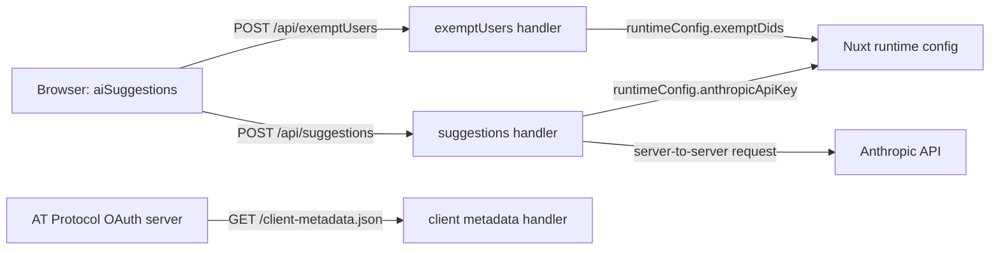

# Server

This directory contains Bluelist's Nuxt/Nitro server runtime surface. It keeps
server-only concerns out of the browser bundle: calling Anthropic with its API
key, applying the AI-suggestion exemption policy, and serving the public OAuth
client metadata document.

Nuxt discovers handlers in this directory at build time and runs them in the
Nitro runtime alongside the application. Client-side code and external OAuth
providers reach these handlers over HTTP; secrets remain in server-side runtime
configuration.

## Immediate Children

| Path            | Boundary                 | Responsibility                                                                               |
| --------------- | ------------------------ | -------------------------------------------------------------------------------------------- |
| `api/`          | Application API          | JSON-oriented endpoints called by the client-side suggestions flow.                          |
| `routes/`       | Public protocol route    | The OAuth client metadata document consumed by AT Protocol authorization servers.            |
| `tsconfig.json` | TypeScript configuration | Extends Nuxt's generated server TypeScript configuration at `../.nuxt/tsconfig.server.json`. |

Each child directory owns its endpoint-specific request, response, validation,
and error-contract documentation. This README describes only the boundary that
joins those handlers into the server runtime.

## Route Registration

Nitro uses file-based route registration. Handler filenames determine their
public paths; the `.ts` extension is not part of the URL. These handlers do not
currently use method-specific filenames or method guards, so they do not reject
non-`POST` requests even though the client calls them with `POST`.

| Source handler                   | Registered route        | Client usage                                                                                |
| -------------------------------- | ----------------------- | ------------------------------------------------------------------------------------------- |
| `api/exemptUsers.ts`             | `/api/exemptUsers`      | The AI suggestions flow posts a DID to check its daily-limit exemption.                     |
| `api/suggestions.ts`             | `/api/suggestions`      | The AI suggestions flow posts serialized follows and existing lists for Anthropic curation. |
| `routes/client-metadata.json.ts` | `/client-metadata.json` | AT Protocol OAuth authorization servers retrieve public client metadata with `GET`.         |

The `api/` prefix is supplied by the directory name. `routes/` contains
non-API public paths, including the literal `.json` suffix in
`client-metadata.json.ts`.

## Configuration

Server handlers obtain private values with `useRuntimeConfig()`. These values
are intentionally not returned to the client and must not be placed under the
public runtime configuration namespace.

| Runtime config key | Used by              | Purpose                                                                                                              |
| ------------------ | -------------------- | -------------------------------------------------------------------------------------------------------------------- |
| `anthropicApiKey`  | `api/suggestions.ts` | Authenticates the server-to-server Anthropic request. It is populated from `NUXT_ANTHROPIC_API_KEY`.                 |
| `exemptDids`       | `api/exemptUsers.ts` | Comma-separated DIDs that bypass the client-managed daily suggestion limit. It is populated from `NUXT_EXEMPT_DIDS`. |

The metadata route uses no secret configuration. It derives its origin from the
incoming request, including forwarded host and protocol headers, so a reverse
proxy must preserve the externally visible origin.

## Runtime Relationship

`api/suggestions.ts` checks required fields, JSON syntax, non-empty arrays, and
prompt size before calling Anthropic; it does not currently validate parsed
array element shape. It returns the generated response as a JSON string for the
client-side orchestrator to parse. `api/exemptUsers.ts` returns an exemption
result for the supplied DID.
`routes/client-metadata.json.ts` publishes OAuth metadata using the request
origin and the shared OAuth scope.

For the endpoint-level contracts, see [api/README.md](api/README.md) and
[routes/README.md](routes/README.md).
