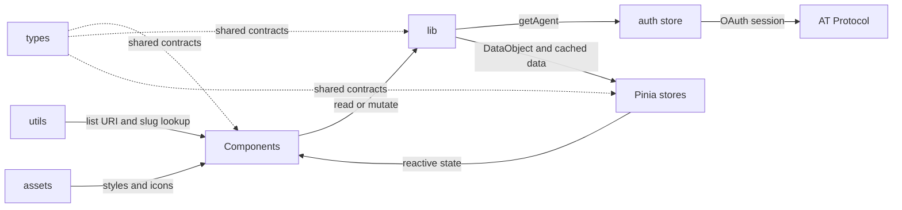

# Source Layer

`src/` contains Bluelist's client-side application layer. It separates Vue
presentation, AT Protocol and AI orchestration, reactive state, shared type
contracts, browser utilities, and visual assets.

## Directory Responsibilities

- [`assets/`](assets/README.md): Shared visual assets: the global theme,
  component-scoped styles, and theme icons.
- [`components/`](components/README.md): Vue components that compose the
  authenticated workspace, render data, collect user intent, and coordinate
  refreshes.
- [`lib/`](lib/README.md): Client-side service boundary for OAuth,
  authenticated Bluesky operations, OAuth scopes, and AI suggestion requests.
- [`stores/`](stores/README.md): Pinia Options API stores for authentication,
  fetched and cached data, current UI data, and AI request limits.
- [`types/`](types/README.md): Shared TypeScript contracts for API responses,
  normalized domain data, store shapes, and renderable display data.
- [`utils/`](utils/README.md): Reusable browser utility functions, currently
  the persistent list URI-to-slug mapping.

## Source-Level Data Flow

The primary client-side path starts with a component or page action. Components
call an operation in `lib/`, which obtains the OAuth-authenticated agent through
the auth store and reads from or writes to Bluesky. Read operations normalize
responses into the shared `DataObject` contract, update the relevant Pinia
stores, and return matching display and serialized JSON data. Components then
render the store-backed display data and emit refresh, pagination, or mutation
intent back through their owning coordinators.

### Authentication And External Calls

`OAuthService.ts` in `lib/` owns the browser OAuth client and turns a restored
or newly authorized session into the authenticated agent stored by `auth.ts`.
Bluesky service functions use `authStore.getAgent()` instead of constructing a
separate agent, preserving the active OAuth session. `aiSuggestions.ts` uses
the authenticated client state and current cached data to call the server-side
suggestions endpoint; provider credentials remain outside `src/`.

### Display And State

`DataObject`, exported from `types/`, is the central display contract. The UI
store holds the active value for general rendering, while follows and lists
stores retain paginated caches and serialized API data. The suggestions store
tracks its local daily allowance and suggestion response. `DataDisplay.vue`
selects the appropriate list, follow, timeline, post, or member presentation,
with `DataCard.vue` and `MemberCard.vue` rendering individual items.

### List Navigation

List data is registered with `utils/slug-utils.ts` as it becomes available.
This keeps a stable browser-persisted connection between a list's AT URI and
the friendly slug used by list detail routes. Component navigation and list
detail loading resolve the slug back to the corresponding URI.

## Extension Guidelines

- Put Bluesky reads and mutations in `lib/bskyService.ts`; update the relevant
  store and return matching `DataObject` and JSON data for reads.
- Define or extend shared contracts in a domain type file and re-export them
  through `types/index.ts`.
- Add a `DataCard.vue` rendering branch when introducing a new `DataObject`
  view type.
- Keep persistent UI state in the appropriate Pinia store, using Options API
  actions for mutations and cross-store access.
- Add component styles under `assets/styles/` and import them from the owning
  component using the established BEM selector convention.
